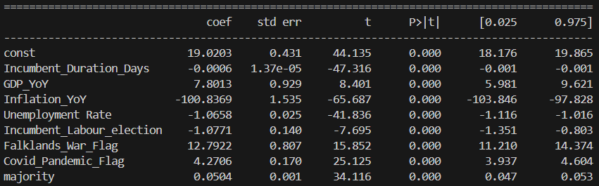
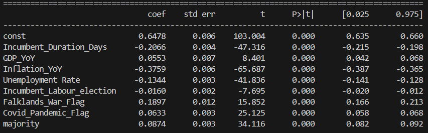

With the aim to casually look at what factors impact how much a political party is winning in the polls, linear regression was done.

This data is normalised

`features = ["Incumbent_Duration_Days", "GDP_YoY", "Inflation_YoY", "Unemployment Rate", 
"Incumbent_Labour_election", "Falklands_War_Flag", "Covid_Pandemic_Flag", "majority", 
]` 

Currently the coefficients are intuitive, where there are manual flags which can't be explained in existing features, perhaps more could be included.

When this is normalized, we can see that inflation, incumbent duration and the falklands war have the biggest impacts.

## Next Steps

* Consider other features
